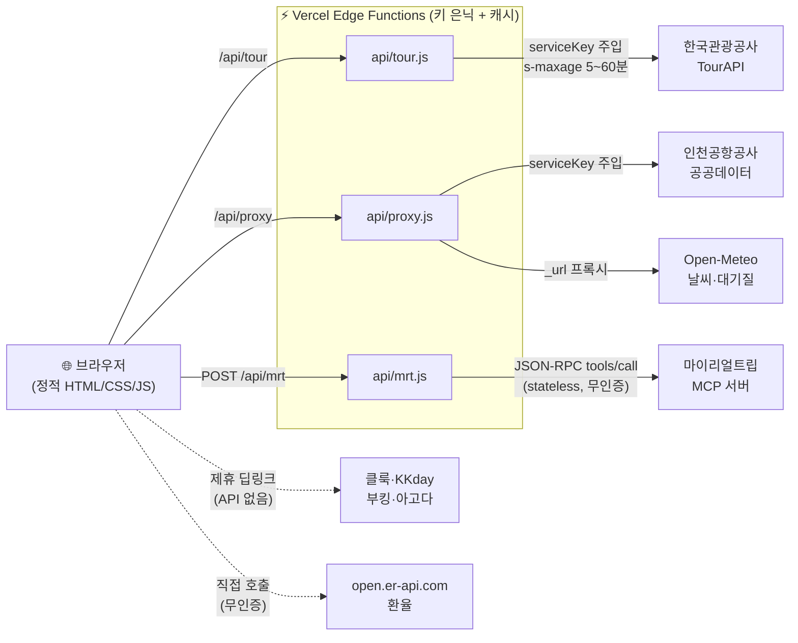

# ✈ 트래블코스트 (TravelCost)


> 국내·해외 여행 정보 + **인천공항 실시간 대시보드** + **여행 상품 메타서치**를 하나로 묶은 한국 여행자용 웹 서비스.
> 5개 외부 데이터 소스를 서버리스 Edge Function 뒤에서 안전하게 통합했습니다.

<p>
  
  
  
  
</p>

🔗 **라이브 데모**
| 페이지 | URL |
|--------|-----|
| 메인 | https://travel-guide-cslis07.vercel.app |
| 인천공항 실시간 | https://travel-guide-cslis07.vercel.app/airport |
| 투어·숙소·항공 메타서치 | https://travel-guide-cslis07.vercel.app/tours |
| 이용가이드 | https://travel-guide-cslis07.vercel.app/guide |

---

## 🎯 무엇을 풀었나

여행 준비는 정보가 **여러 곳에 흩어져** 있습니다 — 관광지 검색은 관광공사, 공항 상황은 공항공사 앱, 투어·숙소·항공은 각 OTA. 트래블코스트는 이걸 **한 사이트에서** 해결합니다.

- 🗺 **국내 관광 검색** — 한국관광공사 TourAPI (지역·업종·키워드·주차·상세)
- ✈ **인천공항 실시간** — 혼잡도·주차·항공편·셔틀 + 출국 준비 도구 (체크리스트·라운지·평면도·카운트다운)
- 🎟 **여행 상품 메타서치** — 마이리얼트립 실시간 결과 + 클룩·KKday·부킹·아고다 가격 비교
- 💱 **환율 + 계산기** · 📖 **이용가이드** · 📱 **PWA**

---

## 🏗 아키텍처

핵심 설계 결정: **모든 외부 API를 브라우저에서 직접 부르지 않고, Vercel Edge Function 프록시를 경유**시켰습니다. 키 노출을 막고, Edge 캐시로 호출량을 줄이고, CORS·응답형식 차이를 서버에서 흡수합니다.



---

## 💡 기술 하이라이트 (면접에서 이야기할 만한 것)

### 1. 🔐 API 키를 클라이언트에서 완전히 제거
정적 사이트는 흔히 API 키를 JS에 하드코딩 → Public 레포에 그대로 노출됩니다.
→ **Edge Function 프록시**로 옮겨 `process.env`에서 키를 주입. 브라우저는 `/api/tour?path=...`만 호출하고 키를 볼 수 없습니다.
> `api/tour.js` — 허용 엔드포인트 화이트리스트 + 엔드포인트별 캐시 TTL

### 2. ⚡ Edge 캐시로 외부 API 호출량 압축
공공데이터는 **일일 호출 한도**(1만 건)가 있습니다.
→ `Cache-Control: s-maxage`로 같은 검색을 여러 사용자가 해도 실제 API 호출은 캐시 TTL당 1회로 수렴. (검색 5분 / 위치 3분 / 상세 30분~1시간 차등)

### 3. 🔌 MCP를 웹에 연동 (stateless JSON-RPC)
마이리얼트립이 공개한 **MCP 서버**(원래 AI 에이전트용)를 raw 프로토콜 분석으로 웹에서 활용.
→ `initialize`/세션 없이 `tools/call`만으로 동작함을 확인 → Edge Function 한 개로 프록시. 응답이 `application/json` 또는 SSE 양쪽으로 오는 것도 파싱 처리.
> `api/mrt.js` — 브라우저가 MCP 프로토콜을 직접 못 쓰는 문제를 서버 프록시로 해결

### 4. 📱 PWA — 네트워크 우선 HTML / 캐시 우선 자산
`sw.js` Service Worker: **HTML·API는 네트워크 우선**(항상 최신), 정적 자산은 캐시 우선(빠름) + 오프라인 폴백. 공항 와이파이가 약한 실사용 환경을 고려.

### 5. 🧩 메타서치 파트너 레지스트리
라이브 API가 없는 플랫폼(클룩·아고다 등)은 **검색어 딥링크 + 제휴 추적 파라미터**로 통합. 파트너 추가가 배열 한 줄로 확장되는 레지스트리 패턴.

### 6. 📐 모바일 우선 + 접근성
44px 터치 타깃, iOS 자동 줌 방지(입력 16px), `env(safe-area-inset-*)`, 가로 스크롤 탭, `aria-live` 결과 영역, 사용자 입력 XSS 이스케이프.

### 7. 🛡 우아한 실패 처리
외부 API 장애 시 빈 화면 대신 안내 메시지, 캐시 폴백, 날짜·중복요청 검증.

---

## 🧰 기술 스택

| 영역 | 사용 |
|------|------|
| 프론트엔드 | Vanilla HTML / CSS / JavaScript (**번들러·프레임워크 없음**) |
| 서버리스 | Vercel Edge Functions (Web Fetch API) |
| PWA | Service Worker + Web App Manifest |
| 외부 데이터 | 한국관광공사 TourAPI · 인천공항공사 공공데이터 · 마이리얼트립 MCP · Open-Meteo · open.er-api.com |
| 시각화 | 인라인 SVG (T1/T2 공항 평면도), Chart.js (인천공항 여객 예측) |
| 배포 | Vercel (GitHub push 자동 배포, `cleanUrls`) |

> **의도적으로 프레임워크를 쓰지 않음** — 정적 여행 정보 사이트에 React/빌드 파이프라인은 과함. 로딩 속도·유지보수·배포 단순성을 우선.

---

## ✨ 주요 기능

<details>
<summary><b>메인 페이지</b> — 환율·계산기·검색·목적지</summary>

- 실시간 환율 바 (5개 통화) + 6통화 계산기
- 항공권/숙소/국내여행 검색 위젯
- TourAPI 국내 관광 검색 (지역·구군·업종·키워드 + 주차/카페 필터 + 상세 모달)
</details>

<details>
<summary><b>인천공항 실시간</b> — 8개 탭 대시보드</summary>

진출입·주차·셔틀철도·출입국장·항공편·시설정보 / ⭐내 편명(카운트다운·게이트 변경 알림·ICS 저장) / 🛫출국 준비(6단계 트래커·체크리스트·SVG 평면도·라운지·수하물/면세)
+ Ctrl+K 통합검색 · URL 딥링크 · 다크모드 · 한/영 · PWA
</details>

<details>
<summary><b>메타서치</b> — 투어·숙소·항공 통합 검색</summary>

마이리얼트립 라이브 결과 + 클룩·KKday·부킹·아고다 비교 딥링크
+ 검색 히스토리 · 항공편 정렬 · 날짜별 최저가 캘린더
</details>

---

## 💻 로컬 개발

> ⚠️ **API를 쓰려면 `vercel dev` 필요.** `api/*.js`는 Edge Function이라 정적 서버(`npx serve`)로는 `/api/*`가 404입니다.

```bash
npx vercel dev        # http://localhost:3000  (API 포함 전체 기능)
npx serve -l 3333 .   # http://localhost:3333  (정적 UI만, API는 404)
```

### 환경변수 (Vercel Dashboard → Settings → Environment Variables)
| 변수 | 용도 |
|------|------|
| `TOUR_API_KEY` | 한국관광공사 TourAPI 키 |
| `ICN_API_KEY` | 인천공항 공공데이터 키 |

> 자세한 보안·캐싱·활용신청 절차는 [`API_SECURITY.md`](API_SECURITY.md), 전체 현황은 [`PROJECT_STATUS.md`](PROJECT_STATUS.md) 참조.

## 🚀 배포

```bash
git push origin master   # → Vercel 자동 프로덕션 배포
```

---

## 📸 스크린샷

라이브 데모에서 직접 확인하거나, 아래 자리에 캡처를 추가하세요 (`docs/` 폴더 권장).

| 화면 | 캡처 자리 |
|------|----------|
| 인천공항 실시간 대시보드 | `docs/airport.png` |
| 투어·숙소 메타서치 결과 | `docs/metasearch.png` |
| T1/T2 SVG 평면도 | `docs/map.png` |
| 모바일 뷰 (PWA) | `docs/mobile.png` |

<!-- 캡처 추가 후 아래 주석 해제:


-->

> 💡 캡처 팁: Chrome DevTools(F12) → 기기 툴바(Ctrl+Shift+M) → iPhone 14 Pro 선택 →
> ⋮ 메뉴 → "Capture screenshot"으로 모바일 뷰를 깔끔하게 저장할 수 있습니다.

---

## 🗺 로드맵

- [x] 목적지 가이드 페이지 (오사카·후쿠오카·도쿄)
- [x] SEO 기반 (OG 이미지·JSON-LD·sitemap·canonical)
- [x] PWA 설치 지원 (PNG 아이콘·shortcuts)
- [ ] 목적지 가이드 추가 확장 (교토·방콕·다낭 등)
- [ ] Vercel KV 캐싱 (트래픽 증가 시)
- [ ] 제휴 어필리에이트 발급값 연동
- [ ] SEO 콘텐츠 글 (수하물·면세·환율 정보)

---

## 📄 데이터 출처 & 라이선스

- 한국관광공사 TourAPI (`KorService2`) · 인천공항공사 공공데이터 (`B551177`)
- Open-Meteo (날씨·대기질) · open.er-api.com (환율) · 마이리얼트립 공개 MCP
- 공공데이터·제휴 딥링크 기반 **비상업 정보 제공** 데모. 상업적 사용 시 각 플랫폼 약관 확인 필요.
